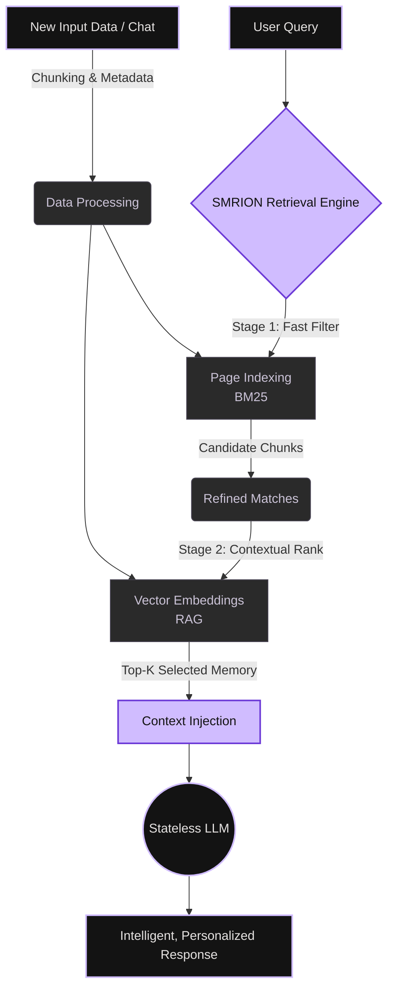

  
  
   
  
  # **SMRION**
  
  **The Persistent Memory Infrastructure for Evolving AI.**
  
  

    <a href="#about">About</a> •
    <a href="#core-capabilities">Capabilities</a> •
    <a href="#system-architecture">Architecture</a> •
    <a href="#the-ecosystem">Ecosystem</a>
  

  
  

---

## 🌌 The Stateless AI Problem

Modern AI models (like ChatGPT and other LLMs) are incredibly powerful, but they share a fatal flaw: **they are inherently stateless**. They do not retain memory across sessions, which drastically limits continuous personalization, long-term reasoning, and real-world usefulness. Every new session is a blank slate.

**SMRION** solves this. We act as an external memory layer that seamlessly stores, retrieves, and injects highly relevant contextual memory back into AI systems.

Just as a database provides persistent storage for traditional applications, **SMRION provides persistent memory for AI.**

---

## ⚡ Core Capabilities

- �� **Persistent Context:** Infinite memory span across every single user interaction.
- 🔐 **Isolated Memory Silos:** Strict, user-specific memory isolation for uncompromised privacy and security.
- 🎯 **Hybrid Retrieval Engine:** Combines semantic vectors with indexed keyword queries for high-precision recall.
- 💉 **Automated Context Injection:** Seamlessly patches relevant historical data directly into active LLM prompts.
- 📊 **Relevance Scoring:** Dynamically prioritizes information so the AI only sees what matters most right now.

---

## 🏗️ System Architecture

The core of SMRION relies on a **Hybrid Memory Retrieval Architecture**. We believe that purely relying on vector embeddings is prone to noise, and purely relying on structured search is too rigid. SMRION marries the two:

1. **Page Indexing (BM25 / Keyword):** Lightning-fast, vectorless retrieval that acts as a first-pass filter to instantly narrow down candidate memory chunks.
2. **Semantic Retrieval (RAG / Embeddings):** Deep contextual understanding that evaluates the filtered chunks to select only the most semantically relevant data.

### The Pipeline Flow

---

## 🪐 The Ecosystem (Dual-Layer Product)

SMRION is designed to accelerate AI evolution on both sides of the market.

### 1. Developer Infrastructure (B2B)
Developers can seamlessly integrate SMRION via REST API or **MCP (Model Context Protocol)** to bestow their autonomous agents or SaaS AI tools with long-term memory. 
- Eliminate token-limit constraints.
- Retain exact user preferences effortlessly over years of interactions.

### 2. End-User Companion (B2C)
For non-technical users (students, writers, professionals), SMRION manifests as a sleek **Browser Extension**. 
- Actively overlays on top of tools like ChatGPT.
- Silently captures, indexes, and retrieves meaningful context from past chats.
- Transforms an amnesiac chatbot into a truly continuous, evolving personal assistant.

---

## 🚀 Vision

**SMRION makes AI remember, learn over time, and become truly personalized.** It is not just a feature—it is the missing foundational layer of the modern AI stack.

   
  
<i>"From stateless models to evolving intelligence."</i>

